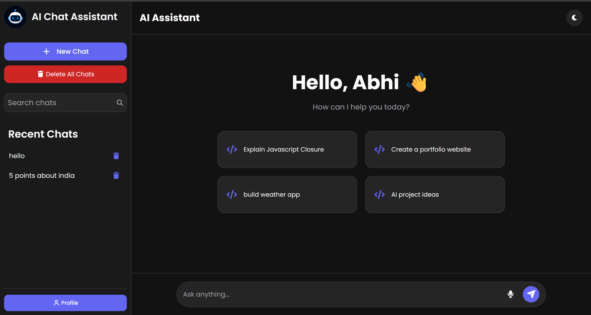
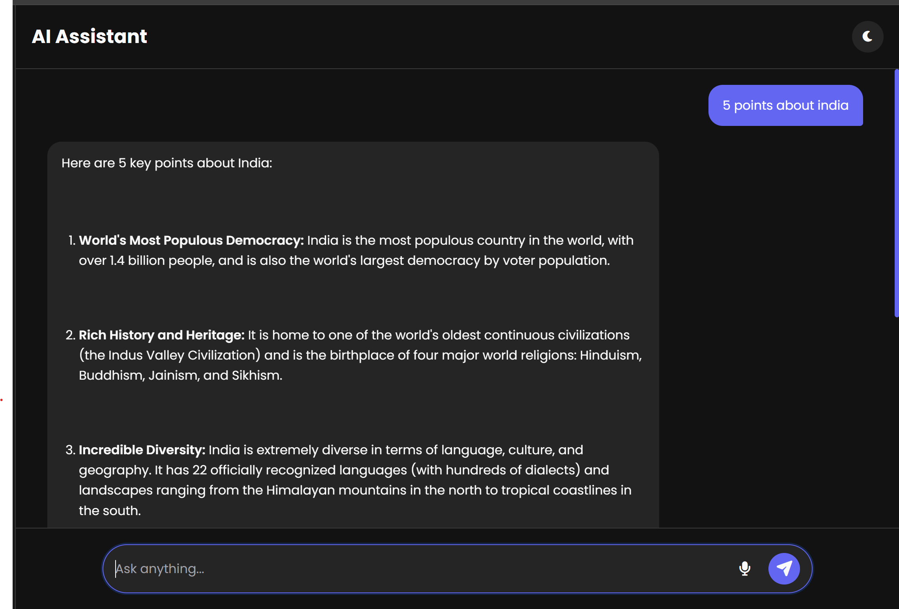
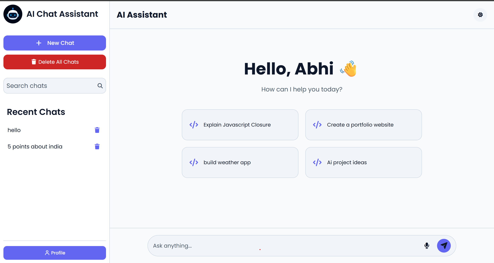
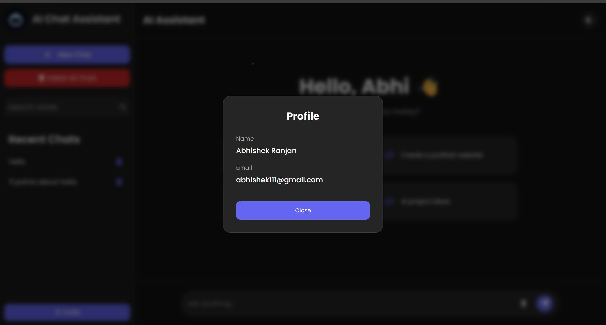

# 🤖 AI Chat Assistant

An AI-powered Chat Assistant built using **HTML**, **CSS**, **JavaScript**, and the **Google Gemini API**. The application provides a modern chat interface where users can interact with an AI assistant in real time. It features chat history, voice input, Markdown support, theme switching, and persistent local storage.

---

## 📸 Screenshots

### Home Screen



### Chat Interface



### Dark Theme



### Profile Popup



---

## 🔑 API Key

For security reasons, the Google Gemini API key has **not** been included in this repository.

To run the project:

1. Get your own Gemini API key from Google AI Studio.
2. Open `script.js`.
3. Replace:

```javascript
const API_KEY = "YOUR_GEMINI_API_KEY";
```
with your own API key.

The application will then work normally.


## ✨ Features

- 💬 Real-time AI conversation using Google Gemini API
- 🎤 Voice input using Web Speech API
- 🌙 Dark / Light Theme
- 📝 Markdown-rendered AI responses
- 📋 Copy AI responses with one click
- 📚 Chat history stored using LocalStorage
- 🔍 Search previous chats
- 🗑️ Delete individual chats
- 🗑️ Delete all chats
- ➕ Start new conversations
- 👤 Profile popup
- 📱 Responsive design for desktop, tablet, and mobile devices

---

## 🛠️ Tech Stack

### Frontend

- HTML5
- CSS3
- JavaScript (ES6)

### APIs

- Google Gemini API
- Web Speech API

### Libraries

- Marked.js (Markdown Rendering)
- Font Awesome (Icons)

### Storage

- Browser LocalStorage

---

## 📂 Project Structure

```
AI-Chat-Assistant/
│
├── index.html
├── style.css
├── script.js
├── logo.png
├── README.md
└── screenshots/
    ├── home.png
    ├── chat.png
    ├── dark-theme.png
    └── profile.png
```

---

## ⚙️ Installation

Clone the repository

```bash
git clone https://github.com/yourusername/AI-Chat-Assistant.git
```


## 📚 What I Learned

Through this project I gained practical experience with

- REST APIs
- Asynchronous JavaScript
- Fetch API
- Promises
- DOM Manipulation
- LocalStorage
- Responsive Web Design
- Browser APIs
- Markdown Rendering
- Voice Recognition API
- Error Handling
- UI/UX Design

---


## 📖 How It Works

1. User enters a prompt.
2. JavaScript sends the request to Gemini API.
3. API returns a JSON response.
4. Markdown is converted into HTML.
5. Response is displayed with a typing animation.
6. Chat is saved to LocalStorage.
7. User can search, reopen, or delete previous conversations.

---

## 👨‍💻 Author

**Abhishek Ranjan**

GitHub: https://github.com/yourusername

LinkedIn: https://linkedin.com/in/yourprofile

---

## ⭐ If you like this project

Please consider giving it a ⭐ on GitHub.